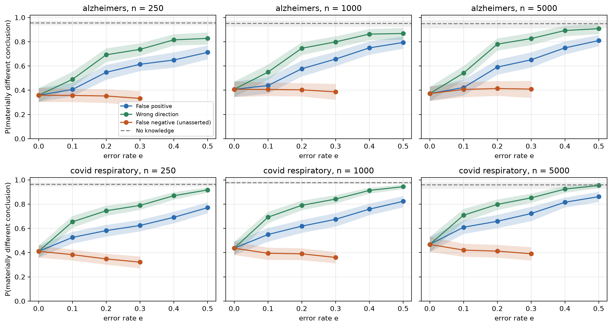
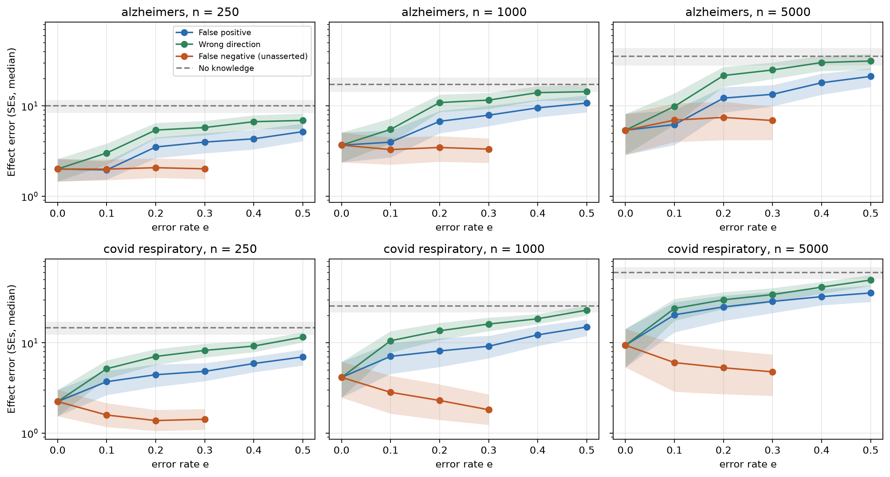
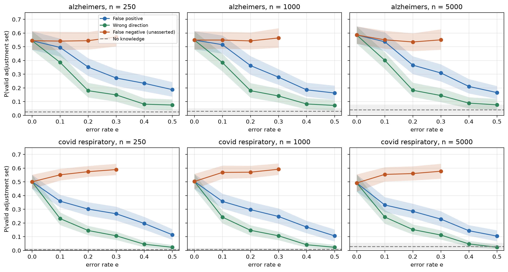
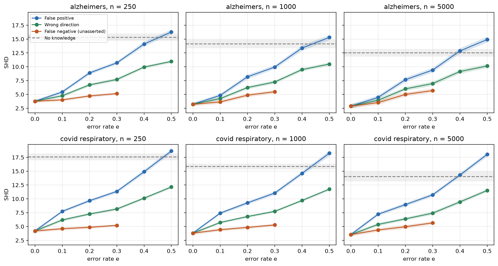

# When Can Causal Discovery Trust Its Priors?

**Question.** Causal discovery algorithms like PC can be given hints ("A causes B", "A and B are not linked"), and LLMs are increasingly proposed as the source of those hints. If some hints are wrong, how wrong do the final causal conclusions become, and which kinds of wrong hints do the most damage?

**Answer in short.** Without hints, PC led to a wrong causal conclusion for about 96% of the treatment–outcome questions tested; correct hints cut this to about 40%. Hints that point an arrow the wrong way were the most damaging: with 20% of them wrong, about 75% of conclusions were wrong again. Hints that invent a link were less damaging. Hints that wrongly said two variables are not linked did not hurt.

---

## Motivation

Kıcıman et al. (2024) show that LLMs can answer causal questions well but fail unpredictably. Srivastava et al. (2025) show that combining LLM hints with the PC algorithm works better than either alone, but that LLM output is noisy. Prior work tests these hybrids at whatever accuracy a particular LLM happens to have. This project instead **controls how wrong the hints are**, so we can see exactly how each type of mistake affects the conclusion, independent of any specific LLM.

## Setup

**Graphs.** Two expert-built causal graphs from recent studies (Srivastava et al., 2025): Alzheimer's disease (11 variables, 19 edges) and COVID-19 respiratory illness (11 variables, 20 edges). Because the true graph is known, every result can be checked against the truth.

**Data.** Simulated from each graph with a linear model, $X_j = \sum_{i \in \text{parents}(j)} w_{ij} X_i + \varepsilon_j$, with $w_{ij} \sim U(0, 2)$ and $\varepsilon_j \sim \mathcal{N}(0, 1)$. Sample sizes of 250, 1,000 and 5,000, each repeated 50 times.

**Hints.** 75% of the true edges are given as "this arrow exists," plus an equal number of "these two are not linked" hints. PC is forced to obey every hint.

**Wrong hints.** A share *e* of the hints (0% to 50%) is made wrong, one type at a time:

| Type | What the wrong hint says |
|---|---|
| Wrong direction | `A → B`, when really `B → A` |
| False positive | `A → B`, when A and B are not linked |
| False negative | "A and B are not linked," when they are (only for links the other hints didn't mention; tested up to 30%) |

**The question asked of each graph.** For every treatment–outcome pair (T, Y) where confounding must be adjusted for (13 pairs in Alzheimer's, 26 in COVID), we read the adjustment set from PC's graph (the parents of T), estimate T's effect on Y, and compare it with the truth.

## Metrics

For a run with confounded pairs $C$: $\hat\beta$ is the effect estimate using PC's graph, $\hat\beta_{\text{correct}}$ the estimate using the true graph, and $\beta$ the true effect.

**1. Wrong conclusion rate** (main metric): the share of pairs where PC's graph leads to a different answer than the true graph would.

$$
P(\text{wrong conclusion}) = \frac{1}{|C|}\sum_{(T,Y) \in C} \mathbb{1}\left[\hat\beta \notin \text{CI}_{95}(\hat\beta_{\text{correct}}) \ \text{ or } \ \text{sign flips} \ \text{ or } \ \text{no adjustment set}\right]
$$

$\text{CI}_{95}$ is the 95% confidence interval of the correct estimate. "No adjustment set" means PC left an edge at T undirected, so the analyst can't tell what to adjust for.

**2. Effect error:** how far the estimate is from the truth, in standard errors (median over pairs).

$$
\text{Effect error} = \mathrm{median}\ \frac{|\hat\beta - \beta|}{\text{SE}(\hat\beta_{\text{correct}})}
$$

**3. Valid adjustment rate:** the share of pairs where PC's adjustment set is correct according to the true graph.

**4. SHD:** the number of variable pairs whose edge PC got wrong (missing, extra, reversed or undirected).

## Results


*Figure 1. Wrong conclusion rate as hint errors increase. Dashed line: PC with no hints.*


*Figure 2. Effect error (log scale). Standard errors shrink with sample size, so compare lines within a panel.*


*Figure 3. Valid adjustment rate.*


*Figure 4. Graph errors (SHD).*

**Wrong conclusion rate** (average over sample sizes):

| Graph | Wrong hint type | 0% wrong | 10% | 20% | 30% | 50% |
|---|---|---|---|---|---|---|
| Alzheimer's | Wrong direction | 0.38 | 0.53 | 0.74 | 0.79 | 0.87 |
| | False positive | 0.38 | 0.42 | 0.57 | 0.64 | 0.77 |
| | False negative | 0.38 | 0.39 | 0.39 | 0.38 | – |
| COVID-19 | Wrong direction | 0.44 | 0.68 | 0.78 | 0.83 | 0.94 |
| | False positive | 0.44 | 0.56 | 0.62 | 0.67 | 0.82 |
| | False negative | 0.44 | 0.40 | 0.38 | 0.36 | – |

No hints: 0.95 (Alzheimer's) and 0.97 (COVID-19).

## Conclusion

1. **Hints are necessary.** Data alone gave a wrong conclusion about 96% of the time; correct hints cut this to about 40%.
2. **Wrong-direction hints are the most dangerous.** Just 10% of them significantly increased wrong conclusions, and by 50% the results were nearly as bad as having no hints. A wrong arrow spreads: PC uses it to orient neighboring edges, so one mistake affects many conclusions.
3. **Invented links do less damage,** because each one adds a wrong variable to only a few adjustment sets.
4. **Wrongly saying two variables are not linked did not hurt.** On COVID-19 it even helped slightly, because removing those links let PC settle directions it had otherwise left undecided.
5. **More data did not help.** Because PC is forced to obey the hints, a bigger sample cannot correct a wrong one.

**Takeaway:** For causal discovery, not all LLM errors are equally dangerous. An incorrect edge direction can propagate through the graph and change downstream adjustment decisions, while an incorrect claim that two variables are connected may have much more localized consequences.

## Limitations

- **Simulated data.** The data follow simple linear relationships with no hidden confounders. Real clinical data are messier.
- **Random mistakes.** Wrong hints were chosen at random, but real LLMs probably make patterned mistakes (for example, confusing similar symptoms).
- **Strict scoring.** If PC couldn't decide an edge's direction at the treatment, that case counted as a wrong conclusion.
- **False negatives only partly tested.** Only "not linked" mistakes about links the other hints didn't mention were tested, and only up to 30%.
- **Small graphs.** Both graphs have 11 variables.

## Future extensions

1. **Use real LLM hints:** ask LLMs about these graphs and see where their actual mistakes fall on these curves.
2. **Test "not linked" mistakes that contradict other hints.**
3. **Allow hidden confounders** (using the FCI algorithm instead of PC).
4. **Treat hints as suggestions instead of rules,** so the data can overrule them.
5. **Build a new clinical graph** for ventilation, kidney injury and sepsis with clinicians.

## Connection to my research

In my lab, I use causal discovery on ICU records (MIMIC-IV) to study sepsis, where it pointed to a possible effect of mechanical ventilation on acute kidney injury that I am now testing with a target trial emulation. That pipeline depends on clinicians' knowledge about which relationships are possible, and the adjustment sets for the trial come from the learned graph. This project asks how wrong that knowledge can be before the clinical conclusion is wrong, a question that matters more as LLMs start supplying that knowledge. My longer-term goal is to make causal conclusions from observational data reliable enough to inform decisions in medicine and policy.

## Repository

```
├── graphs/      the two causal graphs (JSON)
├── scripts/     graphs.py, simulate.py, knowledge.py, discover.py, metrics.py, run_experiments.py
├── notebooks/   analysis.ipynb (figures and tables)
├── results/     graph_metrics.csv, summary_thresholds.csv
└── figures/
```

```bash
pip install -r requirements.txt
python3 scripts/run_experiments.py --jobs 4
# then run notebooks/analysis.ipynb
```

## References

- Kıcıman, E., Ness, R., Sharma, A., & Tan, C. (2024). Causal reasoning and large language models: Opening a new frontier for causality. *TMLR.* [arXiv:2305.00050](https://arxiv.org/abs/2305.00050)
- Srivastava, A., Nagalapatti, L., Jajoo, G., Vashishtha, A., Krishnamurthy, P., & Sharma, A. (2025). Realizing LLMs' causal potential requires science-grounded, novel benchmarks. *NeurIPS 2025.* [arXiv:2510.16530](https://arxiv.org/abs/2510.16530)
- Spirtes, P., Glymour, C., & Scheines, R. (2000). *Causation, Prediction, and Search.* MIT Press.
